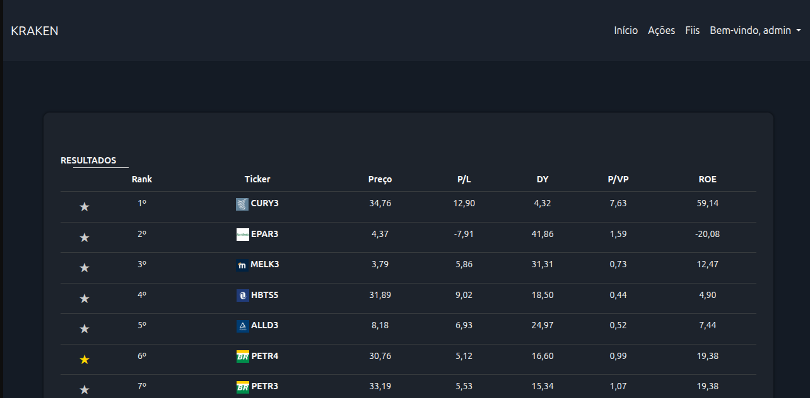

# 🏦 Kraken - Análise de Investimentos

<div align="center">
  
  
  
  
  
</div>

## 📋 Visão Geral

O Kraken é uma plataforma web para análise e rankeamento de ativos financeiros (FIIs e Ações) com base em indicadores fundamentais. A ferramenta utiliza técnicas de machine learning para classificar os melhores investimentos de acordo com critérios personalizáveis.

## ✨ Funcionalidades

- 🏦 Análise detalhada de FIIs e Ações
- 📊 Rankeamento inteligente baseado em múltiplos indicadores
- 🔍 Filtros avançados para busca de ativos
- ⭐ Sistema de favoritos para acompanhamento
- 📈 Visualização clara dos principais indicadores financeiros
- 🚀 Interface responsiva e moderna



## 🛠️ Tecnologias

- **Backend:** Django 5.2
- **Frontend:** HTML5, CSS3, JavaScript, Bootstrap 5
- **Banco de Dados:** PostgreSQL
- **Orquestração:** Apache Airflow
- **ETL:** SQL, Pandas
- **Análise de Dados:** Pandas, Scikit-learn
- **Web Scraping:** Scrapy, BeautifulSoup, Selenium
- **Containerização:** Docker, Docker Compose
- **Outras:** aiohttp, lxml, html5lib

## 🏗️ Arquitetura ETL

O fluxo de ETL (Extração, Transformação e Carregamento) é orquestrado pelo Apache Airflow, garantindo a confiabilidade e rastreabilidade de todo o processo. A arquitetura segue o seguinte fluxo:

1. **Extração**
   - Utilização do Scrapy e Selenium para coleta de dados de fontes financeiras
   - Dados brutos são armazenados temporariamente em formato estruturado

2. **Transformação**
   - Limpeza e normalização dos dados brutos
   - Cálculo de indicadores financeiros
   - Validação e tratamento de dados ausentes
   - Aplicação de regras de negócio

3. **Carregamento**
   - Criação automática de schemas e tabelas no PostgreSQL
   - Carga incremental dos dados processados
   - Manutenção de histórico para análise temporal


O Airflow gerencia todo o fluxo com DAGs (Directed Acyclic Graphs) que são agendadas e monitoradas, garantindo que cada etapa seja executada na ordem correta e com tratamento de falhas adequado.


## Requisitos

- Astronomer-cli - [Download](https://www.astronomer.io/docs/astro/cli/install-cli) 
- Docker - [Download](https://www.docker.com/get-started/) 
- Docker Compose 

## Como usar

Clone o repositório em sua máquina local

```bash
git clone https://github.com/fabiolucasz/kraken.git
```

Renomeie os arquivos `.env-example`  para `.env` nas seguintes pastas:

    - kraken/airflow/.env-example
    - kraken/api/.env-example

Preencha os valores nos arquivos `.env` para conectar ao seu banco de dados e outros serviços.

## Executar pipelines com astronomer

- Execute o seguinte comando

```bash
astro dev start
```


## Executar web app com docker compose

```bash
docker compose up
```

## 📄 Licença

Distribuído sob a licença MIT. Veja `LICENSE` para mais informações.

## ✉️ Contato

Fabio Lucas - [LinkedIn](https://www.linkedin.com/in/fabiolucamz/)

Link do Projeto: [https://github.com/fabiolucasz/kraken](https://github.com/fabiolucasz/kraken)

## 📌 Agradecimentos

- [Django](https://www.djangoproject.com/)
- [Bootstrap](https://getbootstrap.com/)
- [Pandas](https://pandas.pydata.org/)
- [Scikit-learn](https://scikit-learn.org/)
- [Todos os contribuidores](../../contributors)